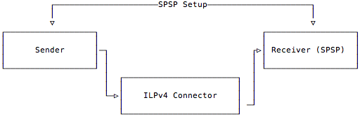

# Local STREAM Packet Termination

## Background

Normally, a Connector only forwards packets from one ILP node to another. Separate, non-Connector nodes typically handle the responsibilities of sending and receiving, often using the Simple Payment Setup Protocol \([SPSP](https://github.com/interledger/rfcs/blob/master/0009-simple-payment-setup-protocol/0009-simple-payment-setup-protocol.md)\). Combined with STREAM payments, receivers normally fulfill any received packets in order to satisfy the Interledger protocol. The following is a simple topology diagram to illustrate this:

In some infrastructures, the extra ILPv4 Prepare call from the Connector to the SPSP receiver is redundant when the accounts actually live inside of the Connector. Especially for very simple SPSP Receivers, it is often more economical to simply have the Connector fulfill any valid STREAM packets, as opposed to forwarding them to a separate runtime.

## Enabling Local Packet Termination

To enable this feature, it is necessary to configure three settings in the Connector, each of which is defined in a configuration property as outlined in [Properties: Local SPSP Termination](configuration.md#properties-local-spsp-payment-fulfillment).

First, Local STREAM termination must be enabled. Next, the `serverSecret` for the SPSP receiver must be specified. 

Finally, the `addressPrefixSegment` must be specified. This last setting determines which ILP destination address prefixes will be intercepted by the connector and routed to the local SPSP/STREAM fulfillment endpoint. The default setting here is `spsp`, which means any address matching `{nodeIlpAddress}.spsp` will be routed to the local termination endpoint. 

For example, imagine a Connector with a `nodeIlpAddress` of `test.foo` . A packet with a destination address of `test.foo.spsp.alice.{anything}` will be routed to the SPSP termination endpoint and processed under the local account of `alice`.

