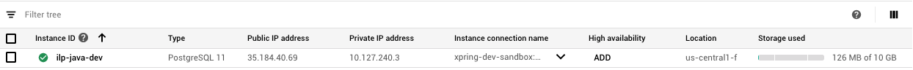

# Running on GCP

To run a connector on GCP, we'll make use of the following GCP products:

* Cloud SQL \(postgres\)
* Cloud Memory Store \(redis\)
* KMS
* GKE
* Cloud Run

This allow us to run a highly available an ILP Connector that is publicly accessible.

Whenever possible, `gcloud` cli will be used to provision GCP resources. Before getting started, you must have [gcloud cli installed](https://cloud.google.com/sdk/install) and run [gcloud auth login ](https://cloud.google.com/sdk/gcloud/reference/auth/login)to connect to your account.

## Creating Cloud SQL database

The connector uses a SQL database to store account settings and routes. 

We'll create a Cloud SQL Postgres database. There's no strict requirements on what region, cpu, memory to use. A typical connector's load on the database is light compared to most applications. One exceptions is that Java uses connection pooling so can have many connections open. The default max\_connections for Cloud SQL of 100 can be too small if running multiple instances of the connector.

We'll also enabled Private IP address via the `--network default` configuration flag. This will allow us to configure the connector to connect to our Cloud SQL address via a private IP.

```
gcloud beta sql instances create connector --cpu=1 --memory=4096MiB \
 --region=us-west1 --database-version=POSTGRES_11 --network default \
 --database-flags max-connections=500 	

```

Once the command has completed, you should see your database in Cloud [console](https://console.cloud.google.com/sql/instances). Note the private IP address as we'll need that later on.



### Setting password for the postgres user

```bash
gcloud sql users set-password postgres -i connector --password=<password>
```

### Creating a connector database

While not mandatory, it is recommended to create a separate database schema for the connector instead of using the default postgres schema. By default, the connector will try to connect using the schema `connector`. To create a connector user, run:

```bash
gcloud sql databases create connector -i connector
```

### Creating a connector user

While not mandatory, it is recommended to create a separate account for the connector instead of using the postgres admin user. By default, the connector will try to connect using the username `connector`. To create a connector user, run:

```bash
gcloud sql users create connector -i connector --password <password>
```

## Creating Cloud Memory Store

The connector uses Redis for tracking balances and for pub/sub messaging between connectors \(if running multiple connector instances\). A typical connector will not need a large amount of Redis storage so we'll create one with the minimum 1GB.

```bash
gcloud redis instances create connector --size=1 --region=us-west1 --redis-version=redis_4_0
```

Once created note, the IP address on the [Memorystore dashboard](https://console.cloud.google.com/memorystore/redis/instances)


## Creating KMS keys

Java connector uses encryption keys to encrypt things like auth tokens and shared secrets for account, as well as other internally secured data. Java Keystore \(JKS\) and KMS are both supported. KMS is recommended because it is easier to manage and configure.

First we need to create a keyring to store connector keys:

```bash
gcloud kms keyrings create connector --location global
```

Now we can generate a key for the connector to use. The default key alias that the connector will use is `secret0`. We'll create a key with that alias:

```bash
gcloud kms keys create secret0 --location global --keyring connector \
 --purpose encryption
```

## Creating GCP Service Account

In order for the connector to be able to use KMS, it will need a GCP service account with KMS encrypt/decrypt permissions.

First we create the service account:

```bash
gcloud iam service-accounts create connector --display-name connector
```

Then we grant the cloudkms.cryptoKeyEncrypterDecrypter to the service account:

```bash
gcloud projects add-iam-policy-binding <gcp-project-id> \
  --member serviceAccount:connector@<gcp-project-id>.iam.gserviceaccount.com \
  --role roles/cloudkms.cryptoKeyEncrypterDecrypter
```

Note: you must replace both instances of `<gcp-project-id>` in the command above with your GCP project id.

### Exporting Service Account JSON in Base64

Later on when you configure your connector, you'll need to provide the GCP service account credentials as a base64 encoded string. This will be used by the connector to authenticate to GCP.

The following command will generate this value:

```bash
gcloud iam service-accounts keys create /dev/stdout --iam-account \
connector@xpring-dev-sandbox.iam.gserviceaccount.com \
--no-user-output-enabled | base64 && echo
```

## Creating Kubernetes Cluster

A docker image is published for the Java ILPv4 connector so the easiest way to run the connector is via docker. For running multiple instances of a connector behind a public load-balancer, Kubernetes with Cloud Run for Anthos provides a convenient setup. Note this will not be the cheapest option as the VM requirements for running Kubernetes are higher than a DIY setup. 

For this example, we'll run 2 instances of a connector on Kubernetes and deploy using Cloud Run. We'll size the Kubernetes cluster with 2 nodes, each node using the 2 cpu + 2 gb \(high-cpu\) e2 machine type.

Big gcloud command incoming....

```bash
gcloud beta container clusters create <connector-name> --zone "us-west1-a" \
 --no-enable-basic-auth --cluster-version "1.13.12-gke.25" \
  --machine-type "e2-highcpu-4" --image-type "COS" --disk-type "pd-standard" \
  --disk-size "10" --scopes "https://www.googleapis.com/auth/devstorage.read_only","https://www.googleapis.com/auth/logging.write","https://www.googleapis.com/auth/monitoring","https://www.googleapis.com/auth/servicecontrol","https://www.googleapis.com/auth/service.management.readonly","https://www.googleapis.com/auth/trace.append" \
  --num-nodes "2" --enable-stackdriver-kubernetes --enable-ip-alias \
  --network default --subnetwork default \
  --addons HorizontalPodAutoscaling,HttpLoadBalancing,CloudRun \
  --enable-autoupgrade --enable-autorepair
```

## Deploying the Java Connector via Cloud Run

To deploy the Java connector docker image, we'll use GCP's Cloud Run for Anthos. This will deploy the connector and configure networking so that it can be publicly accessible.

First we need to create a k8 yaml file to define the connector and configuration:


```bash
apiVersion: serving.knative.dev/v1alpha1
kind: Service
metadata:
  name: connector
  namespace: default
spec:
  template:
    metadata:
      annotations:
        autoscaling.knative.dev/maxScale: '2'
        autoscaling.knative.dev/minScale: '2'
        run.googleapis.com/client-name: cloud-console
    spec:
      containerConcurrency: 80
      containers:
      - env:
        - name: spring_profiles_active
          value: migrate,jks,postgres,gcp-kms
        - name: redis_host
          value: <CLOUD_MEMORY_STORE_IP>          
        - name: spring_datasource_url
          value: jdbc:postgresql://<CLOUD_SQL_PRIVATE_IP>:5432/connector
        - name: spring_datasource_username
          value: connector
        - name: spring_datasource_password
          value: <DB_PASSWORD>
        - name: interledger_connector_adminPassword
          value: <ADMIN_PASSWORD>
        - name: interledger_connector_nodeIlpAddress
          value: test.<YOUR_CONNECTOR_NAME>
        - name: interledger_connector_globalPrefix
          value: test
        - name: interledger_connector_enabledFeatures_require32ByteSharedSecrets
          value: 'false'
        - name: spring_cloud_gcp_project_id
          value: <GCP_PROJECT_ID>
        - name: _JAVA_OPTIONS
          value: -Xmx512m  
        - name: spring_cloud_gcp_credentials_encoded_key
          value: <BASE64_ENCODED_SERVICE_ACCOUNT_JSON>
        image: docker.io/interledger4j/java-ilpv4-connector:0.2.0
        name: user-container
        ports:
        - containerPort: 8080
        readinessProbe:
          successThreshold: 1
        resources:
          limits:
            cpu: 768m
            memory: 768Mi
      timeoutSeconds: 300
  traffic:
  - latestRevision: true
    percent: 100


```


Save the file above as connector-cloudrun.yaml and replace the following placeholders:

* **&lt;CLOUD\_MEMORY\_STORE\_IP&gt;**  - replace with the IP address of your Cloud Memorystore instance
* **&lt;DB\_PASSWORD&gt;** - replace with the password you provided when creating the connector database on your Cloud SQL instance
* **&lt;CLOUD\_SQL\_PRIVATE\_IP&gt;** - replace with the PRIVATE ip address shown for your Cloud SQL instance
* **&lt;ADMIN\_PASSWORD&gt;** - replace with a password of your choosing. This will be used to authenticate as an admin to the REST API on your connector. This password does not have to be the same as your db password.
* **&lt;YOUR\_CONNECTOR\_NAME&gt;** - the name by which your connector will be known on the ILP network. This will be the sub root of your connector's ILP addresses.
* **&lt;GCP\_PROJECT\_ID&gt;** - your GCP project id
* **&lt;BASE64\_ENCODED\_SERVICE\_ACCOUNT\_JSON&gt;** - replace a base64-encoded json for the service account you created above. See _Exporting Service Account JSON in Base64_ section above for how to obtain this value. It should be 1 really long line of text.

Once you've created and edited connector-cloudrun.yaml, you'll deploy the connector using:

```bash
gcloud beta run services replace connector-cloudrun.yaml --platform gke --cluster-location us-west1-a --cluster connector
```

## Configuring DNS and SSL for the connector

If everything has gone well, you should now have connector running but in order to access it, you'll need to set up DNS. To keep things simple, we'll set up DNS to use a free DNS provider [xip.io](https://xip.io). This will get us up and running quickly without needing to set up buy domain name and configure DNS entries.

The following sets of commands require using Kubernetes. If you already have Kubernetes installed, you can use that, otherwise you can use GCP Cloud Shell. To launch Cloud Shell, navigate to [https://console.cloud.google.com/kubernetes](https://console.cloud.google.com/kubernetes) and click on the _Connect_ button, then click on the _Run in Cloud Shell_ button in the popup modal. This should launch a shell terminal modal in your browser.

In order to configure xip.io with a DNS mapping, we need to know the external IP address of your Kubernetes cluster. Run the following command to obtain thisL

```bash
kubectl get service -n gke-system istio-ingress
```

Replace "1.2.3.4" with your External IP address in following command:

```bash
kubectl -n knative-serving patch configmap config-domain \ 
--patch   '{"data": {"example.com": null, "1.2.3.4.xip.io": ""}}'
```

Now we will create a subdomain mapping for the connector \(again replacing 1.2.3.4 with your kubernetes external IP address\):

```bash
gcloud beta run domain-mappings create --service connector --platform gke \
--cluster connector --cluster-location us-west1-a \
--domain connector.1.2.3.4.xip.io
```

Lastly we will configure auto TLS/SSL certs to be generated:

```bash
kubectl patch cm config-domainmapping -n knative-serving \ 
-p '{"data":{"autoTLS":"Enabled"}}'
```

## The End

At this point your connector should be up and running and accessible via a URL like [https://connector.1.2.3.4.xip.io/](https://connector.1.2.3.4.xip.io/)

